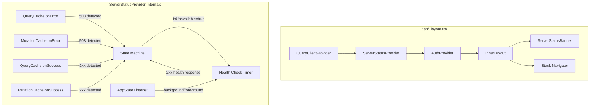

# Design Document: Server Status Banner

## Overview

This feature adds a global server-status detection and notification system to the Zien mobile app. When the backend returns HTTP 503 (Service Unavailable), a non-intrusive animated banner appears across all screens, informing users of the outage. The banner auto-dismisses when connectivity is restored, detected either through normal API traffic or periodic health-check polling.

The design leverages TanStack React Query's `QueryCache` and `MutationCache` global error callbacks to intercept 503 responses without modifying any individual service file or query hook. A dedicated React context (`ServerStatusContext`) manages the state machine, and a reanimated banner component handles the animated overlay.

## Architecture



### Data Flow

1. **Detection**: Any query or mutation that errors with a 503 triggers the `QueryCache`/`MutationCache` `onError` callback.
2. **State Transition**: The `ServerStatusProvider` sets `isUnavailable = true`.
3. **Banner Display**: The `ServerStatusBanner` reads context, animates in via `react-native-reanimated`.
4. **Recovery Path A**: Any subsequent query/mutation success (2xx) triggers `onSuccess` callback → sets `isUnavailable = false`.
5. **Recovery Path B**: A background health-check interval polls a dedicated endpoint. On 2xx → sets `isUnavailable = false`.
6. **App Lifecycle**: `AppState` listener pauses health-check when backgrounded, resumes on foreground.

## Components and Interfaces

### ServerStatusContext

```typescript
// context/ServerStatusContext.tsx

interface ServerStatusContextType {
  isUnavailable: boolean;
}

const ServerStatusContext = createContext<ServerStatusContextType>({
  isUnavailable: false,
});

export function useServerStatus(): ServerStatusContextType;
```

### ServerStatusProvider

```typescript
// context/ServerStatusContext.tsx

interface ServerStatusProviderProps {
  children: React.ReactNode;
}

export function ServerStatusProvider({ children }: ServerStatusProviderProps): JSX.Element;
```

**Internal behavior:**
- On mount, attaches callbacks to the existing `queryClient` via `QueryCache` and `MutationCache` default callbacks configured on the module-level `QueryClient`.
- Manages `isUnavailable` state via `useState`.
- Starts/stops a health-check `setInterval` when `isUnavailable` becomes true/false.
- Listens to `AppState` changes to pause/resume health-check polling.

### ServerStatusBanner

```typescript
// components/ServerStatusBanner.tsx

export function ServerStatusBanner(): JSX.Element | null;
```

**Props:** None (reads from `ServerStatusContext` and `ThemeContext` internally).

**Behavior:**
- Conditionally renders based on `isUnavailable`.
- Uses `react-native-reanimated` `useAnimatedStyle` + `withTiming` for slide-down/up animation.
- Renders with `pointerEvents="box-none"` so underlying content remains interactive.
- Adapts colors to current theme via `useAppTheme()`.

### QueryClient Configuration Change

The existing module-level `QueryClient` in `app/_layout.tsx` will be updated to include `QueryCache` and `MutationCache` instances with global `onError` and `onSuccess` callbacks:

```typescript
// app/_layout.tsx (modified)

import { QueryClient, QueryClientProvider, QueryCache, MutationCache } from '@tanstack/react-query';

// The callbacks will be wired to a shared ref/event emitter that the
// ServerStatusProvider subscribes to.
const queryClient = new QueryClient({
  queryCache: new QueryCache({
    onError: (error) => { /* emit 503 detection event */ },
    onSuccess: () => { /* emit success recovery event */ },
  }),
  mutationCache: new MutationCache({
    onError: (error) => { /* emit 503 detection event */ },
    onSuccess: () => { /* emit success recovery event */ },
  }),
});
```

**Communication pattern:** Since the `QueryClient` is created at module level (before any React context exists), callbacks will write to a module-level event target or ref that the `ServerStatusProvider` subscribes to on mount. A simple approach:

```typescript
// lib/serverStatusEvents.ts

type Listener = (event: 'unavailable' | 'recovered') => void;

let listener: Listener | null = null;

export function setServerStatusListener(fn: Listener | null) {
  listener = fn;
}

export function emitServerStatus(event: 'unavailable' | 'recovered') {
  listener?.(event);
}
```

### Health Check Service

```typescript
// services/healthService.ts

const HEALTH_ENDPOINT = 'https://staging-api.zien.ai/api/health';
const HEALTH_TIMEOUT_MS = 10000;

export async function checkServerHealth(): Promise<boolean>;
```

Returns `true` if the health endpoint responds with 2xx within 10 seconds, `false` otherwise.

## Data Models

### State Machine

The service-unavailable state is a simple boolean with the following transition rules:

| Current State | Event | Next State |
|---|---|---|
| `inactive` | 503 received | `active` |
| `inactive` | non-503 received | `inactive` (no-op) |
| `active` | 2xx received (any source) | `inactive` |
| `active` | 503 received | `active` (no-op, idempotent) |
| `active` | 4xx / non-503 5xx received | `active` (no change) |
| `active` | health-check fails | `active` (retry at next interval) |
| `active` | app backgrounded | `active` (pause health-check timer) |
| `active` | app foregrounded | `active` (resume health-check timer) |

### Error Detection Shape

The `onError` callbacks in React Query receive the error object. The service layer throws or rejects with the HTTP response. We need to extract the status code:

```typescript
function isServiceUnavailable(error: unknown): boolean {
  // Handle fetch Response errors
  if (error && typeof error === 'object') {
    if ('status' in error && (error as any).status === 503) return true;
    if ('statusCode' in error && (error as any).statusCode === 503) return true;
    if ('response' in error && (error as any).response?.status === 503) return true;
  }
  return false;
}
```

### Banner Styling Tokens

| Token | Light Mode | Dark Mode |
|---|---|---|
| Background | `#F59E0B` (amber-500) | `#D97706` (amber-600) |
| Text | `#1F2937` (gray-800) | `#FFFFFF` |
| Icon | `#1F2937` (gray-800) | `#FFFFFF` |

### Health Check Configuration

| Parameter | Value |
|---|---|
| Poll interval | 30 seconds |
| Request timeout | 10 seconds |
| Endpoint | `/api/health` |

## Correctness Properties

*A property is a characteristic or behavior that should hold true across all valid executions of a system — essentially, a formal statement about what the system should do. Properties serve as the bridge between human-readable specifications and machine-verifiable correctness guarantees.*

### Property 1: 503 Activates Service-Unavailable State (Idempotent)

*For any* sequence of API responses where at least one response has status code 503, the service-unavailable state SHALL be active after processing that response, and receiving additional 503 responses while already active SHALL not re-trigger state transitions or side effects.

**Validates: Requirements 1.1, 1.5**

### Property 2: Only 2xx Responses Recover From Unavailable State

*For any* API response received while the service-unavailable state is active, the state SHALL transition to inactive if and only if the response has a 2xx status code (200–299). All other status codes (4xx, non-503 5xx, network errors) SHALL leave the state unchanged.

**Validates: Requirements 1.2, 1.6, 5.4**

### Property 3: Non-503 Responses Do Not Activate When Inactive

*For any* API response with a status code other than 503 received while the service-unavailable state is inactive, the state SHALL remain inactive.

**Validates: Requirements 1.4**

## Error Handling

### Network Errors During Health Check
- If the health endpoint is unreachable (DNS failure, timeout, network error), treat as a failed check and retry at next interval.
- The health-check uses a 10-second `AbortController` timeout to avoid hanging requests.

### Error Detection Edge Cases
- If the service layer throws an error that doesn't have a recognizable `status` field, it is ignored (not treated as 503).
- The `isServiceUnavailable` helper checks multiple common error shapes to handle different service implementations.

### Recovery Race Conditions
- If a user-initiated request succeeds at the same moment the health-check fires, both paths may attempt to set `isUnavailable = false`. Since React `setState` with the same value is a no-op, this is safe.
- The health-check timer is cleared immediately when `isUnavailable` transitions to `false` to avoid unnecessary requests.

### AppState Edge Cases
- If the app is killed while in the background, the timer is naturally cleaned up by the OS.
- On foreground resume, a health-check fires immediately (in addition to restarting the interval) to detect recovery that happened while backgrounded.

## Testing Strategy

### Unit Tests (Example-Based)

| Test Case | What's Verified |
|---|---|
| Banner renders when `isUnavailable` is true | Requirement 2.1 |
| Banner not rendered when `isUnavailable` is false | Requirement 2.1 |
| Banner text is ≤100 characters | Requirement 2.2 |
| Banner uses `pointerEvents="box-none"` | Requirement 2.5 |
| Banner adapts colors to light/dark theme | Requirement 4.4 |
| Banner includes warning icon | Requirement 4.2 |
| Animation duration is between 200ms and 400ms | Requirement 4.3 |
| Health-check interval is 30 seconds | Requirement 5.3 |
| Health-check pauses when app backgrounds | Requirement 5.5 |
| Health-check resumes on foreground | Requirement 5.5 |
| Health-check fires immediately on foreground resume | Requirement 5.5 |

### Property-Based Tests

Property-based testing is appropriate for this feature because the state machine logic is a pure function with clear input/output behavior. The input space (sequences of HTTP responses with varying status codes) is large and the universal properties should hold across all valid inputs.

**Library:** [fast-check](https://github.com/dubzzz/fast-check) (JavaScript/TypeScript PBT library)

| Property | Iterations | Tag |
|---|---|---|
| Property 1: 503 Activates (Idempotent) | 100+ | `Feature: server-status-banner, Property 1: 503 activates service-unavailable state idempotently` |
| Property 2: Only 2xx Recovers | 100+ | `Feature: server-status-banner, Property 2: Only 2xx responses recover from unavailable state` |
| Property 3: Non-503 Doesn't Activate | 100+ | `Feature: server-status-banner, Property 3: Non-503 responses do not activate when inactive` |

**Generator Strategy:**
- Generate arbitrary HTTP status codes (100–599) to form random response sequences.
- For Property 1: Generate sequences containing at least one 503, verify final state is active.
- For Property 2: Start in active state, generate a single non-2xx-non-503 code, verify state stays active. Generate a 2xx code, verify state transitions to inactive.
- For Property 3: Start in inactive state, generate non-503 codes, verify state never becomes active.

### Integration Tests

| Test Case | What's Verified |
|---|---|
| QueryCache onError fires when a query 503s | Requirement 3.3 |
| MutationCache onError fires when a mutation 503s | Requirement 3.3 |
| Banner persists across navigation transitions | Requirements 2.6, 3.4 |
| Provider uses existing QueryClient (no duplication) | Requirement 3.5 |
| Full flow: 503 → banner shows → health-check → recovery → banner hides | Requirements 1.1, 2.1, 5.1, 5.2 |
